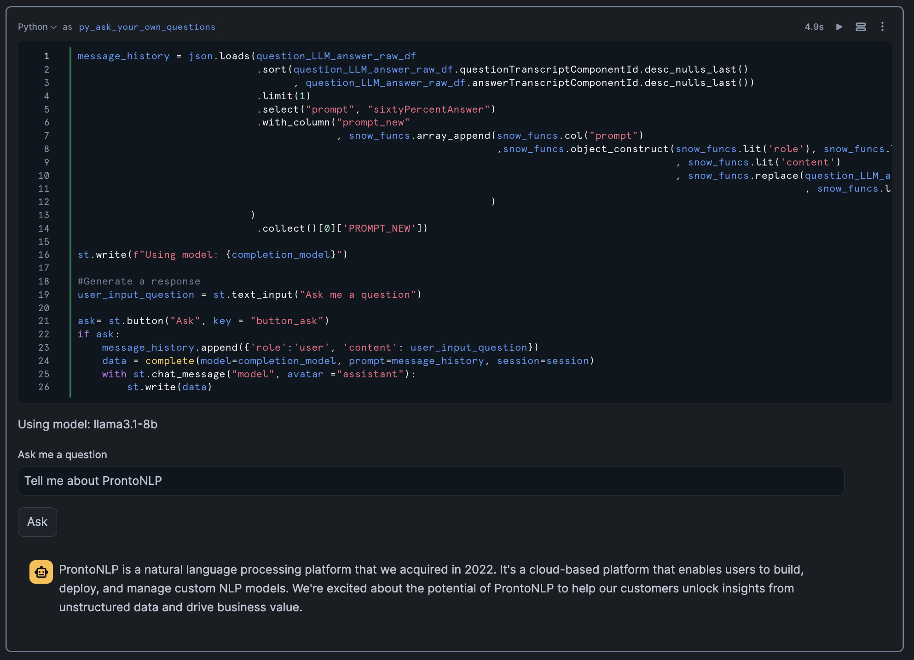
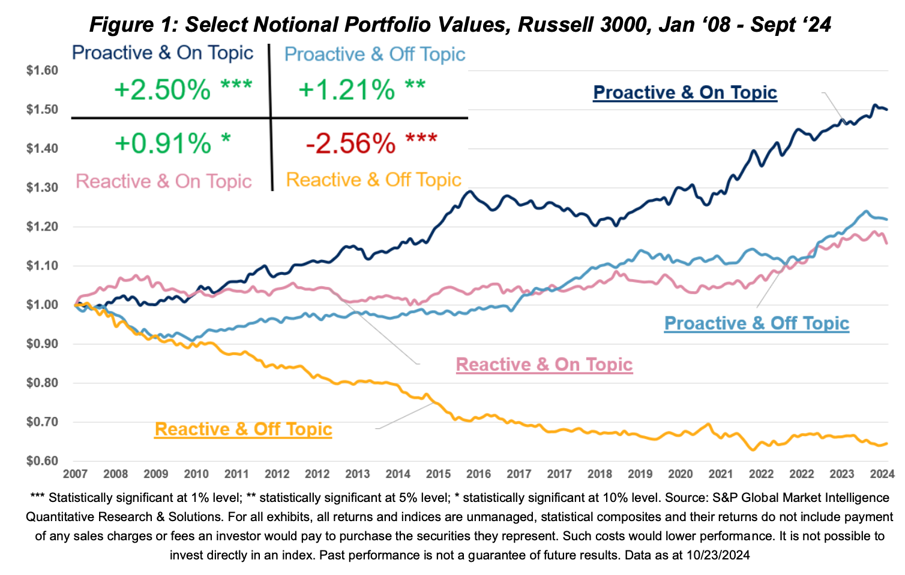

# Unlocking Alpha: AI-Powered Earnings Call Analysis with S&P Global & Snowflake

https://reg.summit.snowflake.com/flow/snowflake/summit25/sessions/page/catalog/session/1738775316002001fMMp

https://go.dataops.live/summit25-earnings-call-analysis

[Quickstart link](https://quickstarts.snowflake.com/guide/s_and_p_market_intelligence_analyze_earnings_transcripts_in_cortex_ai)

- **Date**: June 5, 2025
- **Time**: 14:00 - 15:30
- **Location**: Hands-On Lab 3102 (Basecamp North)
- **Session Code**: AI250

>This hands-on lab explores the integration of Snowflake Notebooks and Cortex AI with S&P Global Market Intelligence’s Machine-Readable Transcripts dataset to analyze executive communication during earnings calls. Learn how to use LLMs and vector similarity techniques to score executives on transparency and responsiveness. Research shows that executives who proactively address market queries with clear answers consistently outperform their peers, while those who are reactive or off-topic tend to underperform. A portfolio strategy based on these communication styles has been shown to generate +515bps of annualized alpha. Join us for a hands-on experience.

## Overview

Hands-on lab session about AI-powered earnings call analysis with S&P Global & Snowflake.

## Key Points

- Get alpha out of earnings call data
- Intro to Snowflake Cortex AI
- Lab will use [this github repo](https://github.com/Snowflake-Labs/sfguide-s-and-p-market-intelligence-analyze-earnings-transcripts-in-cortex-ai)
- Cortex Analyst vs Search

## Background Research
- Cortex to analyze earnings calls (especially Q&A)
  - H1: companies with on-topic answers in Q&A outperform firms that pivot topics
  - H2: Firms proactively addressing issues before Q&A outperform question-prompted responses
- Summarization useful for noise reduction, improved matching, standardization and computational efficient
- Vector embedding w/ cosine similarity between questions and answers
- Publication
  - Questioning the Answers: LLMs enter the Boardroom
  - By Henry Chiang, Liam Hynes, and Daniel Sandberg
  - 🤓 [Publication link:](https://www.spglobal.com/market-intelligence/en/news-insights/research/questioning-the-answers-llms-enter-the-boardroom)

## Technical Details

- Only use top 60% of most relevant questions vs component part (to remove "Good morniing, how are you today?" types of questions)
- Execute Python in Snowflake notebook
- Compare pre-prepared remarks to both answers and questions to assess relevance between them
- Use top 60% of answers "to remove fluff"
- Use low temperature (i.e. zero) to limit variation
- Took two weeks and $20k to run queries
- Can use streamlit in snowflake notebook

## Results

From the publication

